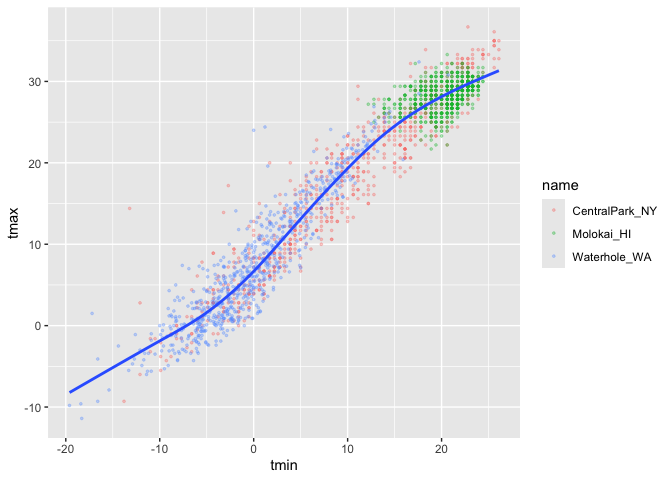
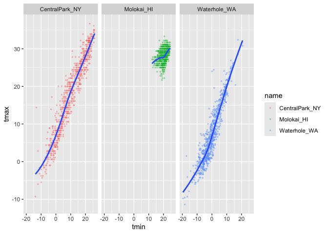
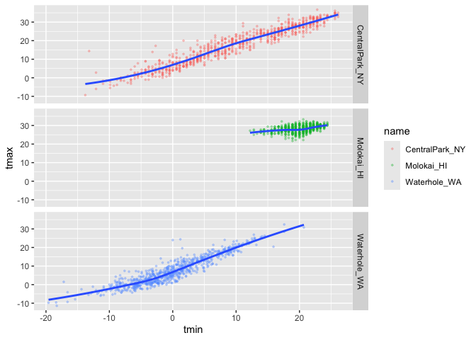
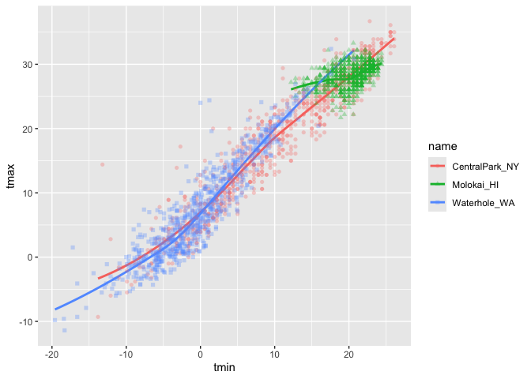
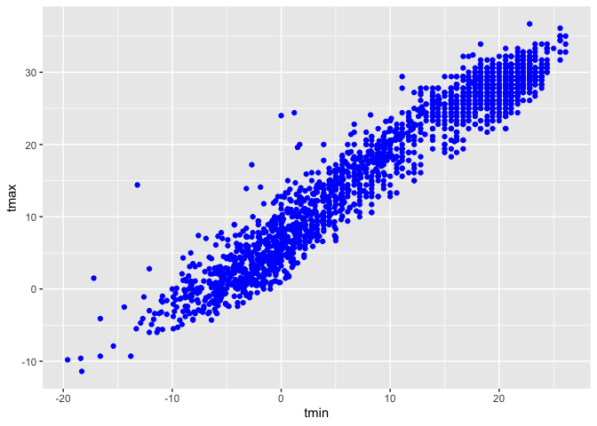
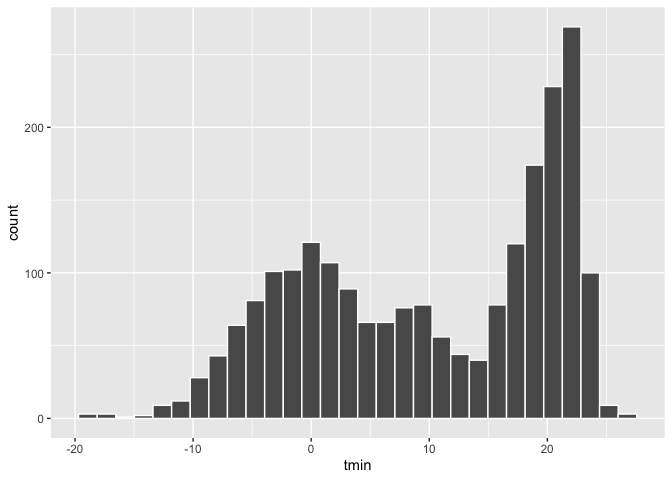
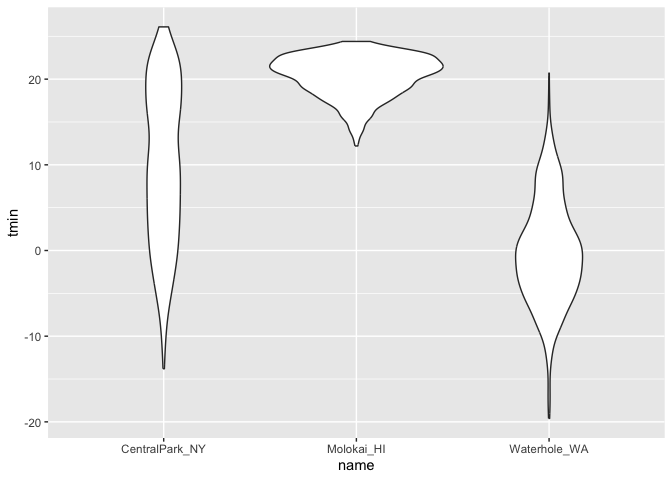

viz_and_eda
================
Juan Tang
2025-09-25

``` r
library(tidyverse)
```

    ## ── Attaching core tidyverse packages ──────────────────────── tidyverse 2.0.0 ──
    ## ✔ dplyr     1.1.4     ✔ readr     2.1.5
    ## ✔ forcats   1.0.0     ✔ stringr   1.5.1
    ## ✔ ggplot2   3.5.2     ✔ tibble    3.3.0
    ## ✔ lubridate 1.9.4     ✔ tidyr     1.3.1
    ## ✔ purrr     1.1.0     
    ## ── Conflicts ────────────────────────────────────────── tidyverse_conflicts() ──
    ## ✖ dplyr::filter() masks stats::filter()
    ## ✖ dplyr::lag()    masks stats::lag()
    ## ℹ Use the conflicted package (<http://conflicted.r-lib.org/>) to force all conflicts to become errors

``` r
library(ggridges)
library(p8105.datasets)
```

import the weather data

``` r
data("weather_df")
```

making the first plot

``` r
ggplot(data = weather_df, mapping = aes(x = tmin, y = tmax)) + 
  geom_point()
```

    ## Warning: Removed 17 rows containing missing values or values outside the scale range
    ## (`geom_point()`).

<!-- -->

``` r
weather_df |>
  ggplot(aes(x = tmin, y = tmax)) + geom_point()
```

    ## Warning: Removed 17 rows containing missing values or values outside the scale range
    ## (`geom_point()`).

<!-- -->

``` r
ggp_weather_scatterplot = 
  weather_df |>
  ggplot(aes(x = tmin, y = tmax)) + geom_point()
ggp_weather_scatterplot
```

    ## Warning: Removed 17 rows containing missing values or values outside the scale range
    ## (`geom_point()`).

<!-- -->

check that some rows are missing

``` r
weather_df |>
  filter(is.na(tmax))
```

    ## # A tibble: 17 × 6
    ##    name         id          date        prcp  tmax  tmin
    ##    <chr>        <chr>       <date>     <dbl> <dbl> <dbl>
    ##  1 Molokai_HI   USW00022534 2022-05-31    NA    NA    NA
    ##  2 Waterhole_WA USS0023B17S 2021-03-09    NA    NA    NA
    ##  3 Waterhole_WA USS0023B17S 2021-12-07    51    NA    NA
    ##  4 Waterhole_WA USS0023B17S 2021-12-31     0    NA    NA
    ##  5 Waterhole_WA USS0023B17S 2022-02-03     0    NA    NA
    ##  6 Waterhole_WA USS0023B17S 2022-08-09    NA    NA    NA
    ##  7 Waterhole_WA USS0023B17S 2022-08-10    NA    NA    NA
    ##  8 Waterhole_WA USS0023B17S 2022-08-11    NA    NA    NA
    ##  9 Waterhole_WA USS0023B17S 2022-08-12    NA    NA    NA
    ## 10 Waterhole_WA USS0023B17S 2022-08-13    NA    NA    NA
    ## 11 Waterhole_WA USS0023B17S 2022-08-14    NA    NA    NA
    ## 12 Waterhole_WA USS0023B17S 2022-08-15    NA    NA    NA
    ## 13 Waterhole_WA USS0023B17S 2022-08-16    NA    NA    NA
    ## 14 Waterhole_WA USS0023B17S 2022-08-17    NA    NA    NA
    ## 15 Waterhole_WA USS0023B17S 2022-08-18    NA    NA    NA
    ## 16 Waterhole_WA USS0023B17S 2022-08-19    NA    NA    NA
    ## 17 Waterhole_WA USS0023B17S 2022-12-31    76    NA    NA

## fancier scatterplots

``` r
##trend line for each color (name)
weather_df |>
  ggplot(aes(x = tmin, y = tmax, color = name)) + 
  geom_point(alpha = 0.3) + 
  geom_smooth(se = FALSE)
```

    ## `geom_smooth()` using method = 'loess' and formula = 'y ~ x'

    ## Warning: Removed 17 rows containing non-finite outside the scale range
    ## (`stat_smooth()`).

    ## Warning: Removed 17 rows containing missing values or values outside the scale range
    ## (`geom_point()`).

<!-- -->

where you define aesthetics can matter

``` r
weather_df |>
  ggplot(aes(x = tmin, y = tmax)) + 
  geom_point(aes(color = name), alpha = 0.3, size = 0.6) + 
  geom_smooth(se = FALSE)
```

    ## `geom_smooth()` using method = 'gam' and formula = 'y ~ s(x, bs = "cs")'

    ## Warning: Removed 17 rows containing non-finite outside the scale range
    ## (`stat_smooth()`).

    ## Warning: Removed 17 rows containing missing values or values outside the scale range
    ## (`geom_point()`).

<!-- -->

``` r
##a smooth line for the entire scatterplot
```

use faceting real quick

``` r
weather_df |>
  ggplot(aes(x = tmin, y = tmax)) + 
  geom_point(aes(color = name), alpha = 0.3, size = 0.6) + 
  geom_smooth(se = FALSE) + 
  facet_grid(. ~name)
```

    ## `geom_smooth()` using method = 'loess' and formula = 'y ~ x'

    ## Warning: Removed 17 rows containing non-finite outside the scale range
    ## (`stat_smooth()`).

    ## Warning: Removed 17 rows containing missing values or values outside the scale range
    ## (`geom_point()`).

<!-- -->

``` r
##create facet plot of three separate plots (columns)

weather_df |>
  ggplot(aes(x = tmin, y = tmax)) + 
  geom_point(aes(color = name), alpha = 0.3, size = 0.6) + 
  geom_smooth(se = FALSE) + 
  facet_grid(name ~ .)
```

    ## `geom_smooth()` using method = 'loess' and formula = 'y ~ x'

    ## Warning: Removed 17 rows containing non-finite outside the scale range
    ## (`stat_smooth()`).
    ## Removed 17 rows containing missing values or values outside the scale range
    ## (`geom_point()`).

<!-- -->

``` r
##rows
```

``` r
weather_df |>
  ggplot(aes(x = tmin, y = tmax, color = name, shape = name)) + 
  geom_point(aes(size = prcp), alpha = 0.3) + 
  geom_smooth(se = FALSE) + 
  facet_grid(. ~name)
```

    ## `geom_smooth()` using method = 'loess' and formula = 'y ~ x'

    ## Warning: Removed 17 rows containing non-finite outside the scale range
    ## (`stat_smooth()`).

    ## Warning: Removed 19 rows containing missing values or values outside the scale range
    ## (`geom_point()`).

<!-- -->

``` r
weather_df |>
  filter(name == "CentralPark_NY") |>
  mutate(
    tmax_fahr = tmax * (9/5) + 32, 
    tmin_fahr = tmin * (9/5) + 32
  ) |>
  ggplot(aes(x = tmin_fahr, y = tmax_fahr)) + 
  geom_point() + 
  geom_smooth(se = FALSE) 
```

    ## `geom_smooth()` using method = 'loess' and formula = 'y ~ x'

<!-- -->

## small things

``` r
weather_df |>
  ggplot(aes(x = tmin, y = tmax, color = name, shape = name)) + 
 
  geom_smooth(se = FALSE) + 
  geom_point(alpha = 0.3) 
```

    ## `geom_smooth()` using method = 'loess' and formula = 'y ~ x'

    ## Warning: Removed 17 rows containing non-finite outside the scale range
    ## (`stat_smooth()`).

    ## Warning: Removed 17 rows containing missing values or values outside the scale range
    ## (`geom_point()`).

<!-- -->

``` r
# points overlaying the line
```

``` r
weather_df |>
  ggplot(aes(x = tmin, y = tmax)) + 
  geom_hex()
```

    ## Warning: Removed 17 rows containing non-finite outside the scale range
    ## (`stat_binhex()`).

<!-- -->

``` r
weather_df |>
  ggplot(aes(x = tmin, y = tmax)) + 
  geom_point(color = "blue")
```

    ## Warning: Removed 17 rows containing missing values or values outside the scale range
    ## (`geom_point()`).

<!-- -->

## Univariable plots

``` r
weather_df |>
  ggplot(aes(x = tmin)) + 
  geom_histogram(color = "white")
```

    ## `stat_bin()` using `bins = 30`. Pick better value with `binwidth`.

    ## Warning: Removed 17 rows containing non-finite outside the scale range
    ## (`stat_bin()`).

<!-- -->

density plot

``` r
weather_df |>
  ggplot(aes(x = tmin, fill = name)) + geom_density(alpha = 0.2)
```

    ## Warning: Removed 17 rows containing non-finite outside the scale range
    ## (`stat_density()`).

<!-- -->

``` r
weather_df |>
  ggplot(aes(x = name, y = tmin)) + 
  geom_boxplot(aes(fill = name))
```

    ## Warning: Removed 17 rows containing non-finite outside the scale range
    ## (`stat_boxplot()`).

<!-- --> violin plot

``` r
weather_df |>
  ggplot(aes(x = name, y = tmin)) + 
  geom_violin()
```

    ## Warning: Removed 17 rows containing non-finite outside the scale range
    ## (`stat_ydensity()`).

<!-- -->
